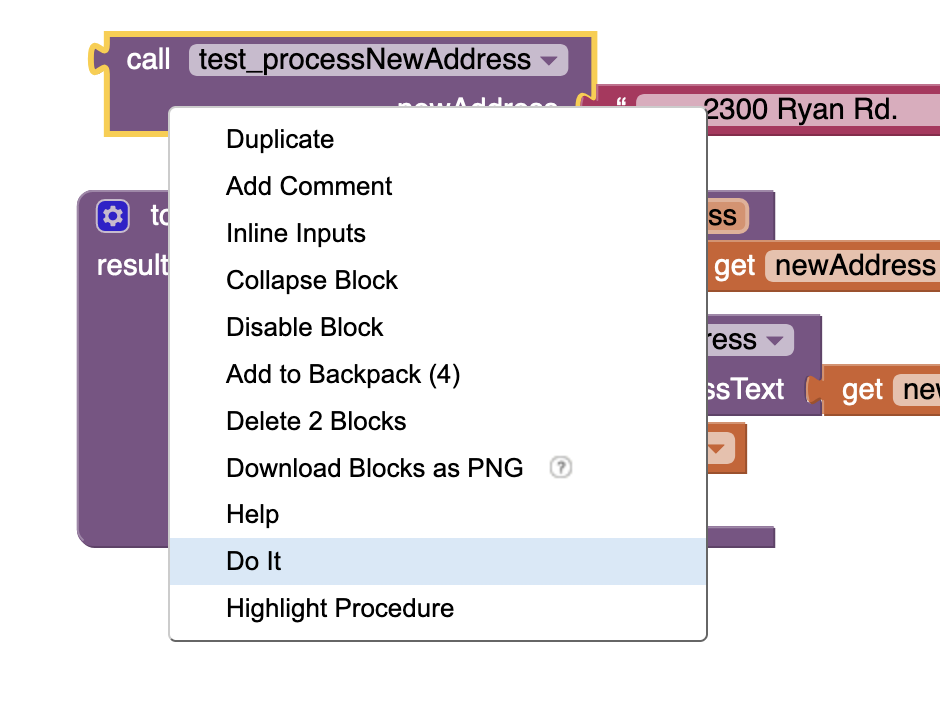
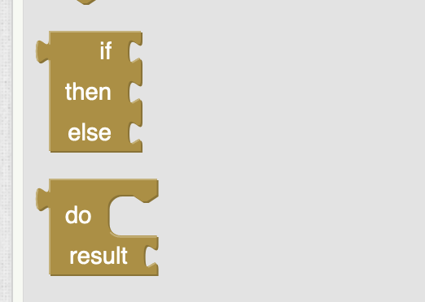
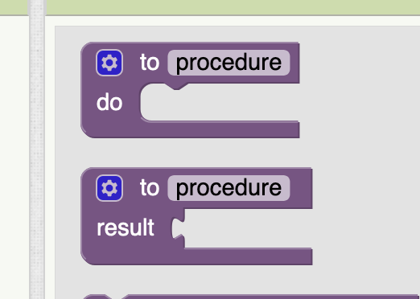
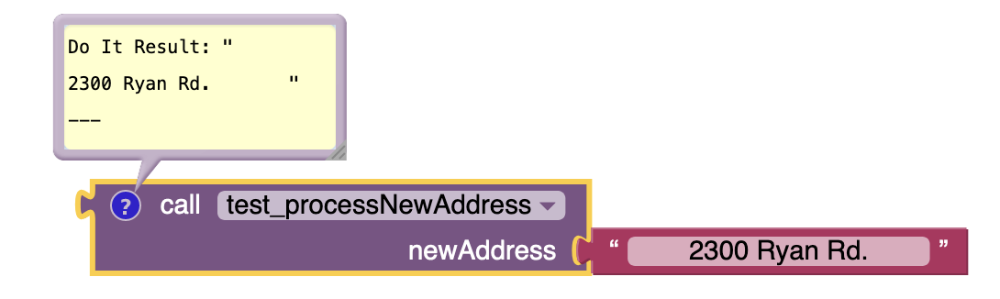
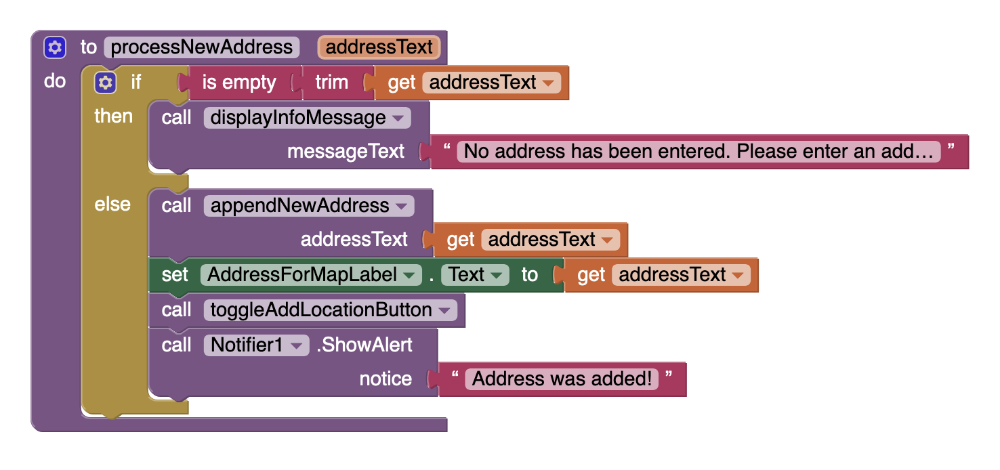
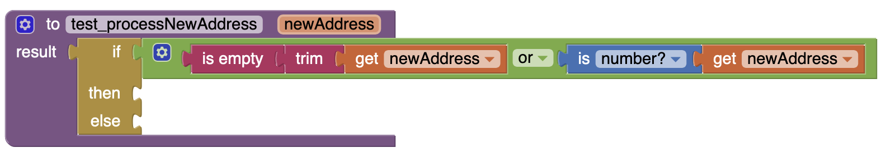
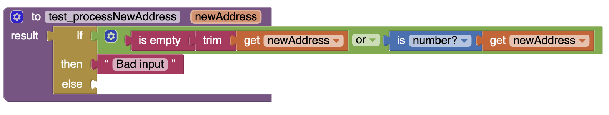
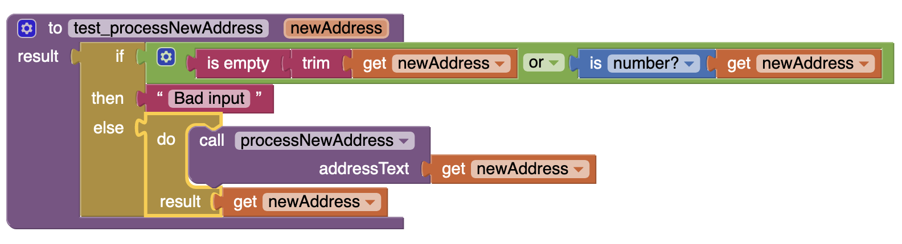

# Map It MVC Testing Guide
_A guide to testing activities in `AI2` using the Map It MVC implementation_

## Introduction
Testing is not an easy activity in `AI2` since it officially provides no defined framework for any testing activities. However, much as with debugging taking the time to test in `AI2` does provide some benefits:

1. Practice with any testing strategy is always good practice, since you are forced to think through issues of coverage and test completeness.
2. Much as with debugging, practicing testing in an unsupported environment will help you develop skills that will use in any testing context.

There are, however, a couple of features of `AI2` that we haven't yet explored that can be useful in a testing strategy. Find out more in the guide below!

## How to use this repository

This repository contains:

1. A guide (this document) describing some testing techniques you can use in AI2.
2. A complete version of the Map It app (MapIt_MVC.aia). 

> This implementation of Map It has precisely the same features as those presented earlier in the semester, but with code organized using the [Model View Controller (MVC)](https://en.wikipedia.org/wiki/Model%E2%80%93view%E2%80%93controller) architectural pattern. If you're not familiar with MVC, don't worry about it for now, but do note that the MVC implementation means the the code is more modular in nature than the original Map It implementation. This will help us develop a more meaningful testing strategy.

You should clone this repository so that you have copies of both the .aia file and the guide locally. You are welcome to follow the steps in the guide below, or to strike out on your own, if you're feeling comfortable with AI2 already.

## A guide to testing in `AI2`

### Assumptions and context
The most important first phase of a testing strategy is to understand the testing context: Meaning what are the design and business considerations of your app/software that testing should _validate_? Most often, this is best represented by the input to app functions/methods/procedures. In other words, what input values are most appropriate, or correct, for the specific procedures you'd like to test.

Broadly speaking, there are two directions we can take with testing:

1. A test-first approach (i.e. [test-driven development](https://en.wikipedia.org/wiki/Test-driven_development)) where tests are written _before_ the actual software is written. This helps to validate (or invalidate) assumptions made during design. Once tests are written and pass given correct inputs, actual software code can be written to match the tests.
2. A test "after" approach where tests are developed after (or during) software development with the aim of ensuring the code written will operate correctly given a wide variety of inputs (including incorrect inputs) and that results are correct.

### Coverage and boundaries
Either way, whether you take a test-first or test-during approach complete coverage of the possible testing domain must be ensured in order to guarantee that tests cover all possible cases. For example, when it comes to procedures that accept numerics as input it is important that all numeric types are tested (e.g. counting numbers, decimal numbers, negative numbers, 0, large numbers, etc.) If one of these particular broad categories is not covered, then there is no guarantee that tested code is absolutely correct.

However, it is impossible to test _all_ elements of a particular category. So tests must test against plausible representative values, or boundary or edge cases. With the example above of the procedure that accepts numeric input, there is no need to test _all_ of the counting numbers (i.e. 1, 2, 3, 4, and up to infinity); rather, testing a small representative number should be sufficient. The case is similar for decimal numbers, except for the fact that decimals with longer decimal expansions will potentially react differently than those with short expansions (i.e. 3.14 vs. 3.1415926535897932384).

Identifying the _right_ categories, and the right cases, can be a huge challenge. But doing so will also help in identifying underlying assumptions, which will help to make more robust code.

### Testing tools in `AI2`

#### Result procedures
Up until now we've used `do` procedures in `AI2`, which are effectively those procedures that execute object-oriented style statements. There is no return guaranteed in `do` procedures (often none is needed), but from a testing perspective this is less than ideal.

Instead, when testing, we'll use `result` procedures:

The `result` procedure guarantees a return value. However, executing statements can sometimes be cumbersome, so we'll combine this with the use of the socket versions of `if-then-else` and `do-result`:

#### Executing result procedures
A right-click context menu item that you may not have noticed yet is the 'Do It' menu item. 'Do It' is only available on procedure calls (i.e. the runnable call block for a procedure) when the app is running in AI Companion or in the emulator:

If all these conditions are true then using 'Do It' allows for the execution of a single procedure, which can be observed in AI Companion or the emulator, and with results communicated in comments in the blocks editor:

### A testing strategy for `processNewAddress`
The code for `processNewAddress` is as follows:

You can clearly see that some effort has already been made to check that proper input is being passed to the procedure. The `addressText` parameter is tested for emptiness after being trimmed, and only then is it used as an argument to the `appendNewAddress` procedure (which you can see is used to populate the global `addressList`, which is then stored in the app's `TinyDB`).

As practice, we might like to think about the testing strategy we would take had we chosen to develop tests _before_ actual code. We would probably want our test to validate all the possible inputs that could be passed to `processNewAddress`, remembering that whatever input is deemed valid will eventually be passed to a `showMap` procedure that calls on Google Maps (or whatever map-based app is installed on the device). So what input is valid?

- Well-formed addresses (of course)
- Search terms (i.e. any word that is searchable, since map apps typically allow searching)
- Latitude and longitude values (probably requires both - not just one!)

#### Strings
Given that "well-formed addresses" and "search terms" pretty much cover the entire gamut of any string that you might considering passing in, it seems pretty clear that `processNewAddress` could probably accept pretty much _any_ string. In fact, the only strings that _might_ not be acceptable are the empty string (i.e. `""` or `" "` with an arbitrary number of spaces) or random assortments of non-English characters (e.g. `@#$#^` or `Dsds34thrd2`, etc.) However, if you try to put these into Google Maps the app won't crash, rather it'll just return with a failed search message. So even those string that we don't want probably aren't going to cause problems long-term.

Despite this, it would be ideal to limit garbage entries from getting passed in to the Map It global `addressList` so they don't appear on the `ListPicker` screen. However, there is no reasonable way to test `AI2` strings for garbage characters. We can easily test for the empty string, but we might have to live with strings like `(&#JMAsww9`. 

#### Numerics
As for numeric inputs: Any longitude/latitude entry into `AI2` would actually resolve as a string, in part because a comma is often used to separate longitude and latitude values. Then we're stuck with not only trying to ascertain if the numbers passed in are valid (i.e. latitude is between -90 and 90 degrees, longitude is between -180 and 180 degrees), but first the string would need to be parsed and split on the comma, or space that separates the two. This challenging (not impossible, but challenging).

Instead, let's think about the _business_ and _design_ needs of the app: How convenient would it be to have lat/long coordinates appear in the Map It `ListPicker` list? Not very, since it's very difficult to guess where any lat/long coordinates point. It's much more convenient to have legitimate addresses in the list. In that sense, we're probably better off _disallowing_ numeric values in Map It. 

#### Validating input
Given the discussion above, our test condition should probably look something like:

If _either_ the `newAddress` parameter is empty, or if it is a number, then we have invalid input. So we should communicate this via a string (since we don't have things like assertions) that says something like "Bad input":

Since we're using a `result` procedure this means that on executing the `then` branch the `test_processNewAddress` procedure returns the string "Bad input", which would be visible as a comment on running the code via "Do It" action.

Now we need to think about what happens when we have _valid_ input. In this case we execute the `else` branch and since we know at that point that our input is valid we should be able to call on `processNewAddress`:

In this case, `processNewAddress` is called via `do` block, since it is a `do` procedure. The `do` block include a `result` (i.e. the return value), and in this case we simply return the `newAddress` value as a signal that the procedure ran correctly and handled the input appropriately. 

Had `processNewAddress` also been coded as a `result` procedure, rather than a `do` procedure, the return value from `processNewAddress` could have been used to test against the `newAddress` value to ensure correctness. This isn't easily achieved here, since `AI2` prefers a `do` procedure orientation; this approach is much easier in a functional paradigm as well.

### Conclusion
The test generated here isn't perfect, and it doesn't solve all the issue identified. However, arguments stepped through above help to clarify the needs of the `processNewAddress` procedure in the context of the design and business logic of Map It. This is important. This is a skill you should cultivate and bring to bear in other projects - even those that have well-established testing frameworks.

There is one further point to be made: You might notice that a number of the actions that `processNewAddress` takes are not accounted for in the `test_processNewAddress` procedure. This is because the approach taken above assumed no knowledge of the actual content of the `processNewAddress` procedure, and valid input was established based solely on what we knew of the design and business needs of Map It, and of the _name_ of the procedure in question: `processNewAddress`. This highlights two key insights:

1. The names you give procedures are incredibly important; and
2. The other actions that `processNewAddress` probably _shouldn't_ be a part of `processNewAddress`. These other actions sound like _extra_, since they don't, in and of themselves, really have anything to do with _processing_ new addresses. Instead, these extra actions involve updating view elements (labels and buttons) and showing notifications. Realistically, these view actions should be taken _only_ once the model is updated, perhaps in the `SubmitButton.click` event, immediately after `processNewAddress` is called.